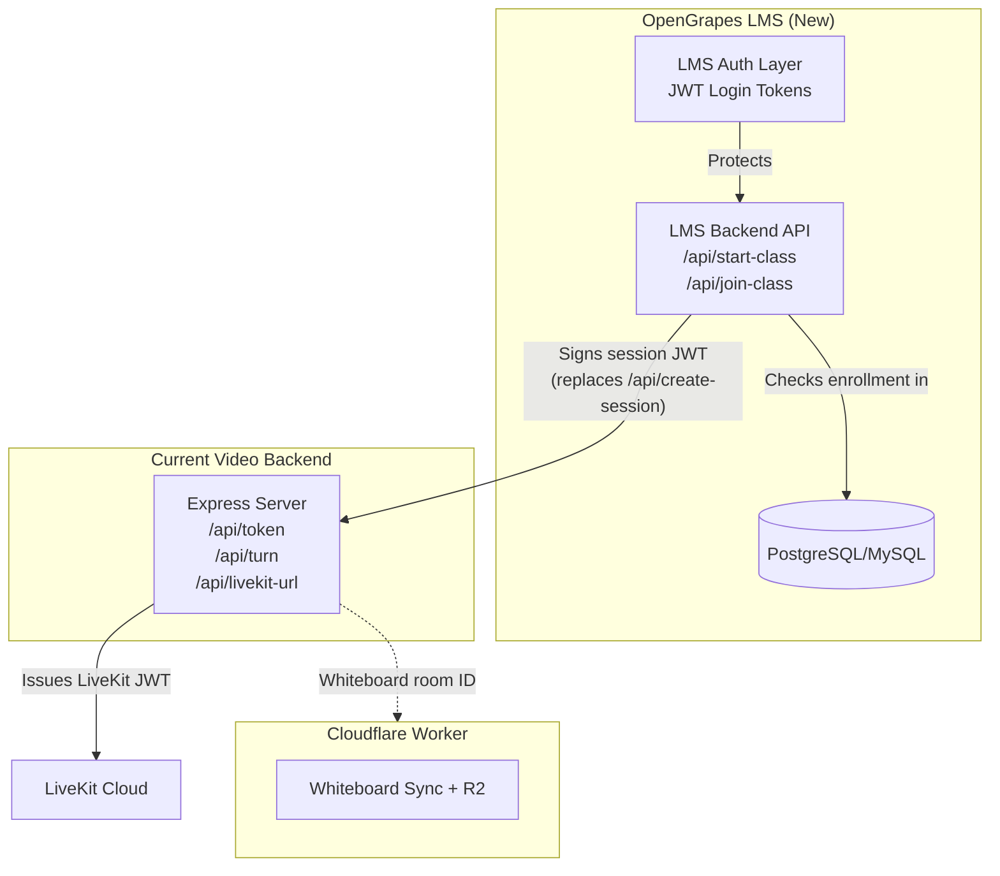

# 🔒 OpenGrapes Live — Security Audit & LMS Integration Analysis

---

## Part 1: Vulnerabilities & Bugs (Ordered by Severity)

---

### 🔴 CRITICAL — Fix Immediately

#### 1. Hardcoded Secrets Committed to Git

> [!CAUTION]
> Your [backend/.env](file:///D:/Code/Video_Call_01/backend/.env) file contains **real production secrets** — LiveKit API keys, Metered.ca API keys, and a session token secret. While `.env` is in your `.gitignore`, the `.env` file currently exists in the repo and your `SESSION_TOKEN_SECRET` is the laughably weak string `opengrapes`.

**What's exposed:**
| Secret | File | Value Committed |
|---|---|---|
| `LIVEKIT_API_KEY` | `.env:1` | `APIHe4i2upH5bzK` |
| `LIVEKIT_API_SECRET` | `.env:2` | `Alru6qoU4Qahw3NDdax6E4rEejXX9f8qYDuJgjepTmNB` |
| `METERED_API_KEY` | `.env:8` | `f14f187d2a8b2bc5b82f20aaff39bda30f99` |
| `SESSION_TOKEN_SECRET` | `.env:10` | `opengrapes` |
| Cloudflare Account ID | `wrangler.toml:5` | `3769189be78c01f88063383ca4a5d7d1` |

**Impact:** Anyone who has cloned or forked your repo (or who has access to your Git history) can:
- Generate valid LiveKit room tokens and join/create any room on your LiveKit Cloud account → **free video calls on your bill**
- Forge session tokens (the secret is just the word "opengrapes") → **bypass all auth**
- Abuse your Metered TURN credentials → **rack up bandwidth costs**

**Fix:**
1. **Rotate ALL secrets immediately** — generate new LiveKit API key/secret from the LiveKit dashboard, new Metered API key, and a strong random `SESSION_TOKEN_SECRET` (use `node -e "console.log(require('crypto').randomBytes(64).toString('hex'))"`)
2. Scrub secrets from Git history using `git filter-repo` or BFG Repo Cleaner
3. Store secrets only in deployment environment variables (Vercel/Railway/etc), never in committed files

---

#### 2. `/api/create-session` Has ZERO Authentication

> [!CAUTION]
> The [/api/create-session](file:///D:/Code/Video_Call_01/backend/src/index.ts#L35-L58) endpoint requires no authentication whatsoever. Anyone can POST to it and receive valid teacher + student JWT tokens.

**Current code** ([index.ts:35-58](file:///D:/Code/Video_Call_01/backend/src/index.ts#L35-L58)):
```typescript
app.post('/api/create-session', (req, res) => {
  const { roomName, teacherName } = req.body;
  if (!roomName) { ... }
  // No auth check at all — anyone can be "the teacher"
  const teacherToken = jwt.sign(
    { roomName, role: 'teacher', teacherName },
    SESSION_TOKEN_SECRET,
    { expiresIn }
  );
```

**Impact:** Any script kiddie can:
1. Call `POST /api/create-session` with `{ roomName: "anything", teacherName: "Hacker" }`
2. Receive a valid `teacherToken` granting teacher role
3. Use that token to call `/api/token` and get a LiveKit JWT with `teacher` metadata
4. Join any room as teacher, toggle whiteboards, broadcast messages, export notes

**This is the single most exploitable vulnerability in the codebase.**

---

#### 3. Cloudflare Worker Endpoints Have No Auth

> [!WARNING]
> All three Cloudflare Worker endpoints are completely open:

| Endpoint | File | Issue |
|---|---|---|
| `POST /api/uploads/:uploadId` | [assetUploads.ts:15](file:///D:/Code/Video_Call_01/whiteboard-sync/worker/assetUploads.ts#L15) | Anyone can upload files to your R2 bucket |
| `POST /api/pdf/:sessionId` | [assetUploads.ts:100](file:///D:/Code/Video_Call_01/whiteboard-sync/worker/assetUploads.ts#L100) | Anyone can overwrite exported PDFs |
| `GET /api/connect/:roomId` | [worker.ts:26](file:///D:/Code/Video_Call_01/whiteboard-sync/worker/worker.ts#L26) | Anyone can connect to any whiteboard room |

**Impact:**
- **R2 storage abuse**: Attackers can upload arbitrary large files to your R2 bucket (the content-type check only blocks non-image/non-video, but a malicious actor can set any header). Your R2 bill could spike.
- **PDF overwrite attack**: A malicious actor can overwrite a class's exported PDF with arbitrary content before students download it.
- **Whiteboard vandalism**: Anyone who guesses or discovers a room name can connect to the whiteboard WebSocket and draw/delete content.

---

### 🟠 HIGH — Fix Before Production

#### 4. No Rate Limiting on Any Backend Endpoint

> [!WARNING]
> The Express backend has **zero rate limiting**. No `express-rate-limit`, no IP throttling, nothing.

**Impact:**
- **Credential brute-forcing**: An attacker can spam `/api/token` with different session tokens to probe for valid ones (though the JWT secret being weak makes this moot — see #1).
- **DDoS on TURN endpoint**: `/api/turn` fetches from Metered.ca. Without rate limiting, an attacker can exhaust the in-memory cache TTL and force hundreds of outbound requests to Metered, potentially hitting their API rate limits and breaking TURN for legitimate users.
- **Token generation flood**: Unlimited calls to `/api/create-session` generate unlimited valid JWTs.

**Fix:** Add `express-rate-limit` middleware:
```typescript
import rateLimit from 'express-rate-limit';
app.use('/api/', rateLimit({ windowMs: 60_000, max: 30 }));
```

---

#### 5. CORS Policy Is Too Permissive

The [CORS config](file:///D:/Code/Video_Call_01/backend/src/index.ts#L10-L24) allows **any** `localhost` or `192.168.x.x` origin:

```typescript
if (
  origin.includes('localhost') ||    // matches "evil-localhost.com"
  origin.includes('127.0.0.1') ||
  /^https?:\/\/192\.168\.\d+\.\d+/.test(origin)
)
```

**Issue:** `origin.includes('localhost')` will match `https://evil-localhost.com`, `https://notlocalhost.attacker.com`, or any domain containing the substring "localhost". This is a bypass.

**Also:** The Cloudflare Worker sets `Access-Control-Allow-Origin: *` on every response — completely open.

---

#### 6. No Input Validation / Sanitization on `roomName` or `participantName`

[/api/create-session](file:///D:/Code/Video_Call_01/backend/src/index.ts#L35-L58) and [/api/token](file:///D:/Code/Video_Call_01/backend/src/index.ts#L63-L101) accept arbitrary strings for `roomName` and `participantName` with no validation.

**Impact:**
- Extremely long room names could cause LiveKit SDK issues or log injection
- Special characters in `participantName` are embedded directly into LiveKit JWT `identity` — could cause issues in LiveKit's internal data model
- The `roomName` is passed directly into URL paths (e.g., R2 object keys, tldraw sync URIs) — potential for path traversal if not sanitized downstream

---

#### 7. No File Size Limit on Cloudflare Worker Uploads

[handleAssetUpload](file:///D:/Code/Video_Call_01/whiteboard-sync/worker/assetUploads.ts#L15-L38) and [handlePdfUpload](file:///D:/Code/Video_Call_01/whiteboard-sync/worker/assetUploads.ts#L100-L120) stream `request.body` directly into R2 without checking content length.

**Impact:** An attacker can upload a 5GB file to your R2 bucket with a single request. Cloudflare Workers have a body size limit (~100MB on paid plans), but that's still significant if abused repeatedly.

---

### 🟡 MEDIUM — Fix Before Scaling

#### 8. Session Tokens Exposed in URL Query Parameters

Both teacher and student tokens are passed via URL query strings:

```
/room/math-101?sessionToken=eyJ...&studentToken=eyJ...
```

**Impact:**
- Tokens are logged in browser history, server access logs, and potentially analytics/CDN edge logs
- Tokens are visible in the URL bar — students may screenshot/share the full URL including the teacher's student token
- Referrer headers can leak full URLs to third-party scripts

**Recommendation:** Use `POST` body or short-lived redirect cookies instead of query params for token passing. At minimum, strip tokens from the URL after reading them (you already do `window.history.replaceState` for `name` but not for `sessionToken`/`studentToken`).

---

#### 9. Client-Side JWT Decoding Without Signature Verification

[decodeJwt](file:///D:/Code/Video_Call_01/frontend/lib/api.ts#L35-L53) in the frontend decodes JWT payloads via `atob()` without verifying the signature:

```typescript
export function decodeJwt(token: string): any {
  const base64 = parts[1].replace(/-/g, '+').replace(/_/g, '/');
  return JSON.parse(jsonPayload);  // No signature check
}
```

This is then used at [page.tsx:49-51](file:///D:/Code/Video_Call_01/frontend/app/room/%5BroomName%5D/page.tsx#L49-L51) to make authorization decisions:
```typescript
const decoded = decodeJwt(tokenInUrl);
return !!nameInUrl && decoded?.role === 'teacher';
```

**Impact:** A student can craft a fake JWT with `role: 'teacher'` in the payload (without a valid signature) and bypass the pre-join screen. The actual server-side check on `/api/token` will still verify properly, but the client-side behavior (skipping PreJoinScreen, seeing teacher UI before connection) is exploitable.

---

#### 10. Data Channel Messages Have No Authentication

Chat messages and whiteboard toggle commands are sent via LiveKit's data channel with no integrity checks:

```typescript
// VideoRoom.tsx:330-333
const msg = JSON.parse(decoder.decode(payload));
if (msg.type === 'SET_WHITEBOARD') {
  setShowWhiteboard(msg.active);  // Trusts the message blindly
```

**Impact:** Any participant (even a student) can broadcast `{ type: 'SET_WHITEBOARD', active: true }` to toggle the whiteboard for everyone, or `{ type: 'NOTES_EXPORTED' }` to make students think notes have been exported (showing a fake download link). The UI treats `participant.metadata === 'teacher'` for local checks, but incoming data channel messages are not filtered by sender role.

---

#### 11. `handleEndClass` Uses `confirm()` / `alert()` — Blocking UI in Production

[VideoRoom.tsx:140-244](file:///D:/Code/Video_Call_01/frontend/components/VideoRoom.tsx#L140-L244) uses browser `confirm()` and `alert()` dialogs. These block the main thread, freeze the video feed, and feel unprofessional. More importantly, the alert on line 244 fires **after** the PDF has been uploaded, but **before** the disconnect — if the user dismisses it slowly, the LiveKit connection stays open consuming resources.

---

### 🟢 LOW — Cleanup / Best Practices

#### 12. `fetchedRef` Can Cause Stale Token Issues on Reconnection

[page.tsx:76-77](file:///D:/Code/Video_Call_01/frontend/app/room/%5BroomName%5D/page.tsx#L76-L77):
```typescript
if (fetchedRef.current) return;
fetchedRef.current = true;
```

If the LiveKit connection drops and the user needs to re-authenticate (token expired), `fetchedRef` is still `true` so the token fetch will never retry, leaving the user stuck. The error case resets it (line 92), but a token expiry mid-session (after initial success) won't trigger this path.

---

#### 13. `editor` State Typed as `any`

[VideoRoom.tsx:78](file:///D:/Code/Video_Call_01/frontend/components/VideoRoom.tsx#L78): `const [editor, setEditor] = useState<any>(null)` — the tldraw editor instance loses all type safety, making it easy to call non-existent methods silently.

---

#### 14. PDF Polling Every 15 Seconds

[VideoRoom.tsx:496-515](file:///D:/Code/Video_Call_01/frontend/components/VideoRoom.tsx#L496-L515) polls the R2 bucket for PDF existence every 15 seconds via `HEAD` requests. For 15 students × 4 classes/day, that's thousands of unnecessary requests. The `NOTES_EXPORTED` data channel broadcast already handles this — the polling is redundant.

---

## Part 2: LMS Integration Analysis

### Your Proposed Flow — Verdict: ✅ Correct Architecture

Your dynamic flow (teacher clicks "Start Class" → backend generates room ID + JWT → students get "Join Class" button → backend verifies enrollment before issuing student JWT) is the **right pattern**. Here are specific recommendations based on what I see in your current codebase:

### What Changes When You Add the LMS



### Key Recommendations

> [!IMPORTANT]
> **Kill `/api/create-session` entirely.** This endpoint currently generates session tokens with no authentication. When your LMS exists, the LMS backend should be the **only** entity that signs session tokens, because only the LMS knows whether a user is an authenticated teacher for that batch.

#### How the pieces fit:

| Current Endpoint | After LMS Integration | Why |
|---|---|---|
| `POST /api/create-session` | **DELETE** — replaced by LMS `POST /api/start-class` | The LMS is the authority on who is a teacher |
| `POST /api/token` | **KEEP** — but add LMS-issued JWT verification | Still needed to generate LiveKit tokens; validate against LMS-signed session tokens |
| `GET /api/turn` | **KEEP as-is** | TURN credentials are infrastructure, not auth |
| `GET /api/livekit-url` | **KEEP as-is** | Config endpoint |

#### On the "Join Class Button Active" Question

> [!TIP]
> **Use WebSocket/SSE from your LMS**, not polling. Your codebase already demonstrates comfort with real-time data channels (LiveKit `publishData`). Use a lightweight WebSocket connection on the LMS dashboard to push `class_started` / `class_ended` events to students. This is simpler and cheaper than polling.

#### On "Should I Pre-Create the Meeting Link?"

**No.** You already identified the right reasons. But there's one more reason specific to your codebase: your current whiteboard sync uses the `roomName` as the Durable Object identifier ([worker.ts:27](file:///D:/Code/Video_Call_01/whiteboard-sync/worker/worker.ts#L27)). If you reuse room names, the whiteboard state from the previous class persists in the same Durable Object. Dynamic room IDs (e.g., `batch-42-session-20260617-abc123`) ensure clean whiteboard state per session.

### Latency Analysis

Your concern about latency is unfounded. Here's the actual breakdown:

| Step | Time |
|---|---|
| LMS verifies enrollment (DB lookup) | ~5-20ms |
| LMS signs session JWT | ~1ms |
| Express verifies session JWT + signs LiveKit JWT | ~5-10ms |
| Browser connects to LiveKit Cloud (WebRTC handshake) | ~200-400ms |
| Browser connects to Cloudflare Worker (WebSocket) | ~50-100ms |
| **Total perceived latency** | **~300-550ms** |

This is faster than Google Meet's join time.

---

## Priority Action List

| Priority | Action | Effort |
|---|---|---|
| 🔴 P0 | Rotate all secrets, generate strong `SESSION_TOKEN_SECRET` | 30 min |
| 🔴 P0 | Add auth to `/api/create-session` (or delete it when LMS ready) | 1 hr |
| 🔴 P0 | Add auth to Cloudflare Worker endpoints (shared secret header) | 2 hrs |
| 🟠 P1 | Add `express-rate-limit` to all backend endpoints | 30 min |
| 🟠 P1 | Fix CORS `includes('localhost')` bypass | 15 min |
| 🟠 P1 | Add input validation for `roomName` / `participantName` | 1 hr |
| 🟡 P2 | Strip tokens from URL after reading | 30 min |
| 🟡 P2 | Filter data channel messages by sender role | 1 hr |
| 🟡 P2 | Replace `confirm()`/`alert()` with proper modal UI | 2 hrs |
| 🟢 P3 | Remove redundant PDF polling (keep data channel broadcast) | 15 min |
| 🟢 P3 | Type the tldraw editor properly | 15 min |
